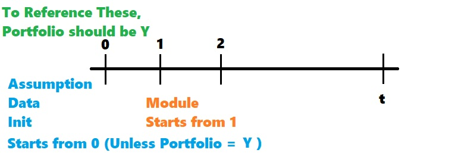

# R3s 정리 - by 동환

## History  

2024-01-11 : 작성 시작 (0.01) - 이동환

---

## 목차

---

> [1. 개요](#1-개요)  
> [2. 컴포넌트](#2-컴포넌트)  
>> <details>
>> <ul>
>>   <li><a href="#assumptions">Assumptions</a></li>
>>  <li><a href="#batches">Batches</a></li>
>>  <li><a href="#categories">Categories</a></li>
>>  <li><a href="#currencies">Currencies</a></li>
>>  <li><a href="#data-processes">Data processes</a></li>
>>  <li><a href="#database-views">Database views</a></li>
>>  <li><a href="#events">Events</a></li>
>>  <li><a href="#filters">Filters</a></li>
>>  <li><a href="#groupings">Groupings</a></li>
>>  <li><a href="#initialization-modules">Initialization modules</a></li>
>>  <li><a href="#layer-modules">Layer modules</a></li>
>>  <li><a href="#life-tables">Life Tables</a></li>
>>  <li><a href="#loops">Loops</a></li>
>>  <li><a href="#models">Models</a></li>
>>  <li><a href="#mtf-views">MtF Views</a></li>
>>  <li><a href="#output-reports">Output reports</a></li>
>>  <li><a href="#projected-data-processes">Projected data processes</a></li>
>>  <li><a href="#run-time-parameter-sets">Run-time parameter sets</a></li>
>>  <li><a href="#stochastic-processes">Stochastic processes</a></li>
>>  <li><a href="#user-functions">User functions</a></li>
>> </ul>
>> </details>
> [3. 변수](#3-변수)  
> [4. 모듈](#4-모듈)  
>
>> + 공통모듈
>> + 스탠다드 코드  
>> + 제안사항
>
> [5. 컴파일](#5-컴파일)  
> [6. 런 관련](#6-런-관련)  
> [7. Excel 익스텐션](#7-excel-익스텐션)  
> [8. 기타](#8-기타)  
---

## 1. 개요  

### 구조에 대해서

> 예를 들면, 부채 모댈의 경우에는 데이터 -> CF -> PV 레이어로 구성되어 있고,  
> 해약환급금 계산 작업의 경우에는 삼이원 모듈을 이용한다.
>
>>``` mermaid
>> flowchart LR
>>    a[Data \n Layer]
>>    b[CF \n Layer]
>>    c[PV \n Layer]
>>    a --> b -->c
>>```
>

### 데이터 소스와 컴파일/런타임 소요시간 간의 관계성

> ``` mermaid
> flowchart LR
>   a[데이터 소스]
>   b[Category]
>   c[많아짐 : 컴파일 오래걸림 런타임 적게걸림]
>   d[적어짐 : 컴파일 적게걸림 런타임 오래걸림]
>   a-->b
>   b--->c  
>   b--->d  
> ```
>
> 일반적으로 일반적인 프로그램을 짜려고 할 수록 조건 제어문이 많아지기 때문에, 논리연산이 많아지면서 계산소요시간이 증가한다.

> ### [카테고리](#categories)란?
>
> ```mermaid
> flowchart TB
>   subgraph Category A
>       a[Data1] --> b[Program1] 
>   end
>   subgraph Category B
>       c[Data2] --> d[Program2]
>       e[Data3] --> d
>       f[Data4] -->  d
>       f --> b
>   end
>
>   subgraph Category C
>       g[Data5] --> h[Program3]
>       g-->b
>        g-->d
>   end
>  
> ```
>
> 데이터와 프로그램 간의 묶음쌍이라고 생각하면 된다.

### 프로그램 작성시 목적적합한 [모듈](#4-모듈)을 지정할 것

> 필요한 [모듈](#4-모듈)만으로 프로그램 구성

---

## 2. 컴포넌트  

### Assumptions  

> Model, Data Source, Projection layer, Module 모두에서 불러오기가 가능하다.
>>
>> ### 불러오는 법
>>
>> 
>> 
>> ### 주의사항
>>
>> 각 컴포넌트에서 호출 시마다 Assumption 데이터를 참조하게 되어 데이터 로드에 걸리는 시간이 길다.  
>> ㄴ 우회법: Initialization module에 한 번 호출 후 필요한 값에 대해서 계속 유지시키는 방법이 있다.
>>

<span style="font-size: 10px;">

[목차로 돌아가기](#목차)

</span>

---

### Batches  

<span style="font-size: 10px;">

[목차로 돌아가기](#목차)

</span>

---

### Categories


<span style="font-size: 10px;">

[목차로 돌아가기](#목차)

</span>

---

### Currencies

<span style="font-size: 10px;">

[목차로 돌아가기](#목차)

</span>

---

### Data processes

> ### 데이터 불러오기 기능
>

<span style="font-size: 10px;">

[목차로 돌아가기](#목차)

</span>

---


### Database views


<span style="font-size: 10px;">

[목차로 돌아가기](#목차)

</span>

---

### Events

<span style="font-size: 10px;">

[목차로 돌아가기](#목차)

</span>

---

### Filters

<span style="font-size: 10px;">

[목차로 돌아가기](#목차)

</span>

---

### Groupings

<span style="font-size: 10px;">

[목차로 돌아가기](#목차)

</span>

---

### Initialization modules

<span style="font-size: 10px;">

[목차로 돌아가기](#목차)

</span>
---

### Layer modules

<span style="font-size: 10px;">

[목차로 돌아가기](#목차)

</span>

---

### Life Tables

<span style="font-size: 10px;">

[목차로 돌아가기](#목차)

</span>

---

### Loops

<span style="font-size: 10px;">

[목차로 돌아가기](#목차)

</span>

---

### Models

<span style="font-size: 10px;">

[목차로 돌아가기](#목차)

</span>

---

### MtF Views

<span style="font-size: 10px;">

[목차로 돌아가기](#목차)

</span>

---

### Output reports

<span style="font-size: 10px;">

[목차로 돌아가기](#목차)

</span>

---

### Projected data processes

<span style="font-size: 10px;">

[목차로 돌아가기](#목차)

</span>

---

### Run-time parameter sets

<span style="font-size: 10px;">

[목차로 돌아가기](#목차)

</span>

---

### Stochastic processes

<span style="font-size: 10px;">

[목차로 돌아가기](#목차)

</span>

---

### User functions

<span style="font-size: 10px;">

[목차로 돌아가기](#목차)

</span>

---

## 3. 변수

>### Rollback 변수
>
> 반대 스텝 방향으로 돌아가는 변수이다.   
> **t시점**부터 **0시점**까지 -1스텝 씩 돌아간다.  

>### 포트폴리오 변수
>
> 
> <center> 모듈과 함께 돌아가는 변수  </center> </br>
>
> 두가지 의의가 있다.  
>
> + 각종 컴포넌트간에서 해당 데이터를 참조하기 위해 포트폴리오 변수로 지정해주어야 한다.
> + 직전기 정보를 저장하고 참조하기 위해서는 포트폴리오 변수로 지정해주는 것이 필수이다.  

>
>### 변수 참조 속성
>
>#### `<변수명>.Prev`
>
> 포트폴리오 속성이 Y일 때, 직전 스텝의 값을 참조한다.
>
>#### `<변수명>.Start`
>
>#### `<변수명>.End`
>
>#### `<변수명>.Curr`
>
>#### `<변수명>.Total`

>#### 특정 시기의 정보를 참조하고 싶을 때
>> 해당 레이어 전체 복제 후 계산결과에서 참조.  
>> or 어레이를 생성하여 스택(Stack) 방식으로 `t-n` 시기의 값을 저장한다. 
>> 
>> 예시:
>>> 변수 5개 만들어서 5개 스텝 값 순환하며 리프레시  
>>> 아니면 Array 생성하여 5칸 계산


>### 시스템 변수
>

<span style="font-size: 10px;">

[목차로 돌아가기](#목차)

</span>

---

## 4. 모듈

변수들의 집합. 매 변수들에 값 혹은 수식을 할당함.

<span style="font-size: 10px;">

[목차로 돌아가기](#목차)

</span>

---

## 5. 컴파일

<span style="font-size: 10px;">

[목차로 돌아가기](#목차)

</span>

---

## 6. 런 관련

<span style="font-size: 10px;">

[목차로 돌아가기](#목차)

</span>

---

## 7. Excel 익스텐션

<span style="font-size: 10px;">

[목차로 돌아가기](#목차)

</span>

---

## 8. 기타

<span style="font-size: 10px;">

[목차로 돌아가기](#목차)

</span>

---
